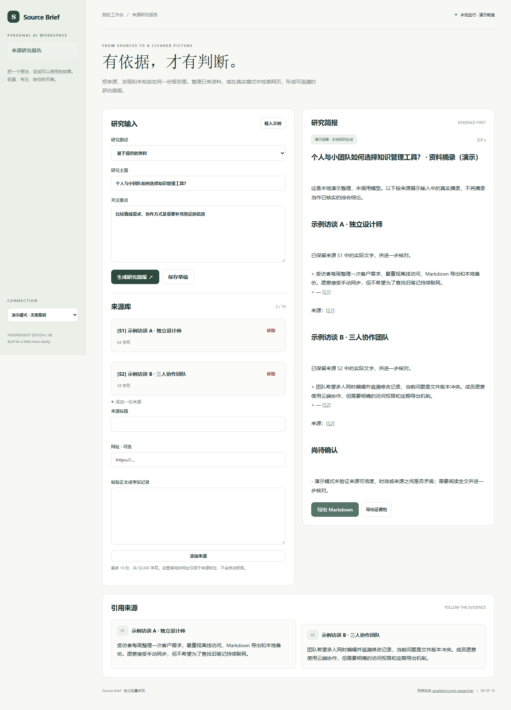

# Source Brief

把来源、发现和未知放在同一份报告里。整理已有资料，或在真实模式中检索网页，形成可追溯的研究简报。

- 资料研究与可选联网检索两种路径
- 手动来源库、真实引句校验与编号引用
- 发现、证据、信息缺口共同组成研究报告
- Markdown 报告与 JSON 证据包导出



## 快速开始

需要 Node.js 24 或更新版本；无第三方运行依赖，无需 npm install。

```sh
git clone https://github.com/Yiwen-Yang-BA/chatgpt-source-brief.git
cd chatgpt-source-brief
npm start
```

打开 http://127.0.0.1:3106 。默认进入**演示模式**，不调用 API，界面会明确标识规则生成的演示结果。

### 接入真实模型

复制 `.env.example` 为 `.env`，填写 `OPENAI_API_KEY`，按账号权限设置 `OPENAI_MODEL`，然后重启服务并切换界面中的「真实模型」。`OPENAI_BASE_URL` 必须支持 OpenAI Responses API；仅兼容 Chat Completions 的服务不适用。密钥只在服务端读取，不写入前端或仓库。

```sh
# Docker（可选；必须显式传入配置）
docker build -t chatgpt-source-brief .
docker run --rm -p 127.0.0.1:3106:3106 --env-file .env chatgpt-source-brief
```

## 使用方法

1. 选择资料研究并添加来源正文，或选择联网研究（需支持 web_search 的真实模型）。
2. 填写研究主题及重点；网址在资料模式仅作为标注，不会自动抓取。
3. 生成报告后，点击编号或网页引用核对来源。
4. 检查待补充的问题，导出报告与完整证据包。

## 验证

```sh
npm run check
npm test
```

测试覆盖业务规则以及本地 HTTP 服务、模拟模型接口、输入校验和错误处理。真实付费模型调用需要用户配置有效密钥，未将演示测试作为真实模型质量验证。GitHub Actions 在每次推送时运行检查。

## 参考与复刻范围

灵感来自 [assafelovic/gpt-researcher](https://github.com/assafelovic/gpt-researcher)（Apache-2.0）。查询快照：2026-10-04；29,893 stars；最近推送 2026-10-01。这是当前星标量与更新状态，**不是近一个月新增星标排名**。

本仓库是对其核心交互和用途的独立轻量实现，未复制上游源码、商标或静态资源，不声称实现上游的全部功能，也不属于上游官方产品。

复刻 GPT Researcher 的有来源研究简报核心用途。资料模式分析粘贴正文；联网模式使用 OpenAI Responses web_search。没有递归研究代理、后台长任务、多轮自动爬取或 PDF 导出。联网检索可产生额外工具费用，取决于所配置服务的支持与权限。

## 数据与部署边界

来源与主题可手动保存为本地草稿。报告保留在当前页面，导出后可保存；联网模式由所配置的模型服务访问互联网。 演示模式数据不离开本机；真实模式会将本次输入发送至所配置的模型服务。

默认只监听 127.0.0.1，适用于单人本地使用；没有多用户登录或持久数据库。如需公网部署，请先增加身份验证、配额和 HTTPS。服务限制请求大小、并发和超时，禁止从静态目录读取密钥文件。

接口实现依据 [OpenAI 官方文本生成文档](https://developers.openai.com/api/docs/guides/text)。

## License

MIT — independent implementation.
